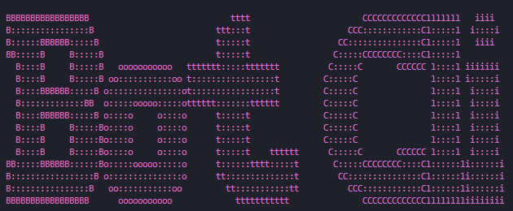

# BotCli
 
Bot Cli is a [discord.py](https://github.com/Rapptz/discord.py) project generator for a structure that I prefer.

# Prerequisites
- [Python 3.8+](https://www.python.org/downloads/)
- [Docker](https://www.docker.com/) (Optional)
- [A Brain](https://en.wikipedia.org/wiki/Brain) (Optional)

# Installation
1. Install the package with [pip](https://pip.pypa.io/en/stable)
```bash
pip install botcli
```

# Usage
Simply just run
```
makebot
```
and follow the prompts provided

# Support
Join the [TND Discord Server](https://discord.gg/GqdWT74Qwx)

# Contributing
Pull requests are welcome. For major changes, please open an issue first to discuss what you would like to change.

# License
This project is under the [MIT License](https://opensource.org/license/MIT)
